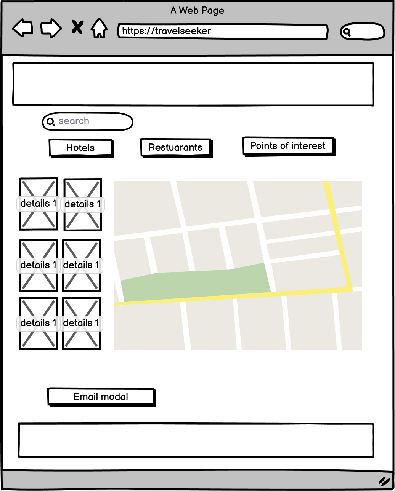

# TravelSeeker

## Objectives of the project
The objective of the website is point the user to accommodation, places to eat and places of interest in the selected city. 
                `
## UX

It will be available for user from all over thw world as the results offered from the search

## User Goals

1. A website with appealing visual content.
2. An accessible website on a desktop, tablet and mobile.
3. Displaying the accomodation, places to eat and places of interest from the selected city.
4. Providing details of the location selected.
5. Contact form available to contact the slected locations selected for additional information.

## User Stories
  * As a user, I want to know the location and opening times of the gym.
  * As a user, I want to find information about yhe location selected.
  * As a user, I want to able to contact the gym.
  * As a user, I want to find a website that is easy to navigate.
  * As a user, I want the website to be intuitive as this will leave me with a positive attitude towards learning more.
  * As a user, I want to feel that I will get a swift response from the contact form inquiry submission.
  * As a user, I want the social media links to open in a new browser.

## Site Owners Goals

* Provide information for the prospective traveller the details of city they are interested in visiting
* Offer the user an intuitive experience in achieving their goal of getting the desired information they want. 
* Stand out from the competition.

## User Requirements and Expectations
### Requirements
  *  Accessing relevant content from google places to inform the user about the city of their choice. 
  *  A navigation menu that is easy to use.
  *  Appealing visual elements.
  *  Access to contact the business returned from the search.

### Expectations
  * Clear information of the selected area.
  * Links opening in a new browser, such as social media links and timetable pdf.
  * A response when the contact form input has been submitted successfully.
  * The customer successfully obtains the required information to make a positive judgement.

## Design Choices
### Fonts
I have used the "Roboto" font from [Google Fonts](https://fonts.google.com/) and liked the way it presents although I did explore the website for other fonts and have noted other styles for future projects.

### Icons
The use of icons has been kept the minimum and from the [Fontawesome](https://fontawesome.com/) library and use them for social media and a download option.

### Colours
The colour scheme used for the website was a green background with golden lettering. I chose these colours because i wanted the user to feel an air of quality and exclusivity, from previous subconscious experience. This colour scheme is like that used by Rolex and Wimbledon tennis tournament (this was underway during the design process). I hoped the clientele for the gym would be familiar with these and connect those entities of quality and would also be associated with the gym.

### Structure
For my website I chose to use [Bootstrap](https://getbootstrap.com/). Bootstrap is a library of HTML, CSS & JavaScript, & API's focused on mobile first. As this is the primary format for the website to be displayed it helps improve the website presentation on a mobile device.

## Wireframes
### &nbsp;&nbsp;&nbsp;&nbsp;&nbsp;&nbsp;&nbsp;&nbsp;&nbsp;&nbsp;&nbsp;&nbsp;&nbsp;&nbsp;&nbsp;&nbsp;Desktop &nbsp;&nbsp;&nbsp;&nbsp;&nbsp;&nbsp;&nbsp;&nbsp;&nbsp;&nbsp;&nbsp;&nbsp;&nbsp;&nbsp;&nbsp;&nbsp;&nbsp;&nbsp;&nbsp;&nbsp;&nbsp;&nbsp;&nbsp;&nbsp;  Tablet &nbsp;&nbsp;&nbsp;&nbsp;&nbsp;&nbsp;&nbsp;&nbsp;&nbsp;&nbsp;&nbsp;&nbsp;&nbsp;&nbsp;&nbsp;&nbsp;&nbsp;&nbsp;&nbsp;&nbsp;  Mobile  

## Features
### Existing Features
#### Navigation

Using Bootstrap and keeping its styling consistent ith the rest of the website the navbar. The navbar is responsive with a collapsible menu, accessed via a burger icon.
The 'sticky' in position gives a professional and pleasing style for the website.

#### About Us

 In bootstrap a single column has been created and a brief statement about the service prodived by the website.

#### Search

There are 3 search criteria type of location, region & city. Type of location & Region have drop down lists and the third uses google places autocomplete to make a selection list. when the city is selected the search automatically starts. The returned information is accessed using a google maps key that accesse local information for those from google places.

#### Results

The map is located to the selected city and markers drop on the map for the chosen criteria, to the right of the map is a listbox of the locations with a corresponding letter on the marker. Clicking on either a marker on the map or a location in the will open an info window over the map, Within this is info box is the location name telephone number website address and star rating. Clicking on the name of the location in the infor-box will ope that locations website in a new tab.

#### Contact Us

A contact us button when clicked will open a modal. This curently open to have a form which asks for your forename, surname , email and your enquiry. This is linked the emailJS to generate an email.
Clicking the close button closes the modal returning the user to website.

#### Footer

A single column with a central heading with social media icons below this, these open the relavant social media in a new page when selected.

### Features to be implemented
 * Resolving the csp issue.
 * Adding images of the location and the points of interest searched.
 * Populate email with details of multiple locations selected and venues requested bu user to be sent to us to taylor a package for them.
 * All customer information is dealt with in accordance of GDPR regulations

## Technologies Used
### Languages
 * [HTML](https://en.wikipedia.org/wiki/HTML)
 * [CSS](https://en.wikipedia.org/wiki/CSS)
 * [JavaScript](https://en.wikipedia.org/wiki/JavaScript)

 ### Libraries
 * [Bootstrap](https://getbootstrap.com/docs/4.5/getting-started/introduction/)
 * [Google fonts](https://fonts.google.com/)
 * [Fontawesome](https://fontawesome.com/)
 * [Google API - maps and places](https://developers.google.com/maps/documentation/places/web-service/overview)
  
 ### Tools
 * [GitHub](https://github.com/)
 * [GitPod](https://gitpod.io/)
 * [Balsamic](https://gitpod.io/)
 * [W3C HTML Validation](https://validator.w3.org/)
 * [W3C CSS Validation](https://jigsaw.w3.org/css-validator/#validate_by_input)
 * [TinyPNG](https://tinypng.com/)
 * [Coolors](https://coolors.co/)
 * [Chrome Dev Tools (incl Lighthouse)](https://developer.chrome.com/docs/devtools/)
 * [Unicorn Revealer (extension on Chrome Development Tools)](https://chrome.google.com/webstore/detail/unicorn-revealer/lmlkphhdlngaicolpmaakfmhplagoaln?hl=en-GB)
 * [JSHint](https://jshint.com/)

## Testing
### Approach and Tools
As I had deployed my website by my midpoint meeting with my mentor [Richard Wells](https://github.com/D0nni387/) I was in a position to commence testing my website. I was using chrome's web DevTool on every change I made to the website to see the impact and if it met expectations.

Once I had the structure in place, I began testing across other devices screen sizes with chrome's DevTools. Further down the development timeline I also included testing on actual devices; A samsung s20 Ultra, samsung s8, iphone 12 and ipad 4 to complement chrome DevTool.

I also was able to ask family to review the website on their devices for their opinion and issues they encountered.

### Validator Testing
I also used the following to fine tune the process;
 * W3C Markup validator tool for HTML.
  - No issues were found with this [W3C HTML Validation](https://validator.w3.org/).
 * W3C CSS validator tool for CSS
  - No issues were found with this [W3C CSS Validation](https://jigsaw.w3.org/css-validator/#validate_by_input).
 * JSHint (JSHint developer tools) a tool that detects errors and potential problems in JavaScript code.
  - No issues were found with this
 * Lighthouse (chrome developer tools) for security and load times.
  - A csp issue was found with this [Chrome Dev Tools (incl Lighthouse)](https://developer.chrome.com/docs/devtools/).

### Bugs and Solutions
#### Google Map - search
- *Bug* - When the autocomplete had been used and a city had been selected but failed to populate the search for the local content in google places.
- *Fix* - I was able to resolve the issue with the use of the DOM to olace the search value on the search criteria after review the relavant lesson..
- *Verdict* - When the city is selected, the selection returns the requested information.

#### Google Map - viewed on mobile devices
- *Bug* - When the website is viewed on mobile devices google maps is not reponsive. The embed map using iframe returns a "X-Frame-Options' to 'sameorigin'", 
          using comments in stackoverflow there were solutions that required server access or more advanced javascipt/php solutions.
- *Fix* - When reviewing the code and referring to the course and w3schools I used the @media to revise the google map width.
- *Verdict* - The google map is now reponsive in mobile devices.

#### Google Map - standard map markers.

- *Bug* -The standard map returned after the search also contains markers for businesses and points of interests which could cause the user confusion with the markers reyurned from the user search
- *Fix* - Changing from the standard map style to 'satellite' resolved the issue, leaaving only the markers from the users search.
 - *Verdict* - Th user is left with only the markers fro.

#### Google Map - csp issue.

- *Bug* -The standard map returne after the search also contains markers for businesses and points of interests which could cause the user confusion..
- *Fix* - It was identified that a forward slash was the cause of the error and once removed the pdf correcting opened.
 - *Verdict* - The PDF download correctly opens in a new page.

## Deployment

The project after the completed code has been committed and pushed to GitHub can be deployed and [found here.](https://davej66.github.io/dfg/). This is achieved by navigating to the page holding the project repository and executing the following steps:

1. From the menu select **Settings**.
2. Scrolling down the vertical menu (topped by Options) select **Pages** which leads to the **Source section**.
3. Under Source click the drop-down menu labelled None and select Main Branch.
4. You are then required to choose a folder, either Docs or root. You should select root.
5. You can now save these selections and the link to the deployed website will be displayed.
6. The website is live https://davej66.github.io/m2-travelseeker/ .

### To run the project locally:
To achieve this by the following process;
1. Under the repository name and the menu that contains Gitpod click Code.
2. Select HTTPS the location will already be present.
3. To the right of this address is an icon once this clicked the location will be cloned.
4. the clone can be found at this [https://github.com/Davej66/m2-travelseeker.git](https://github.com/Davej66/m2-travelseeker.git).

## Credits

I have used the following 4 websites to gather inspiration for content.

- https://www.tripadvisor.co.uk/
- https://www.stackflow.com/
- https://www.google.com/
- https://pxhere.com/

I used pxhere to obtain commercially free to use images for this site.
The code for the "Jumbotron" was taken from the codeinsitute as was much of the remaining coding used in this project.

## Acknowledgements

Thanking my mentor [Richard Wells](https://github.com/D0nni387/) for his invaluable guidance and support. His suggestions during the mid-review led to improvements to website and accelerated my development and comprehension, furthermore at the final review.

Support from the slack community when seeking assistance for that gentle nudge in the right direction.
